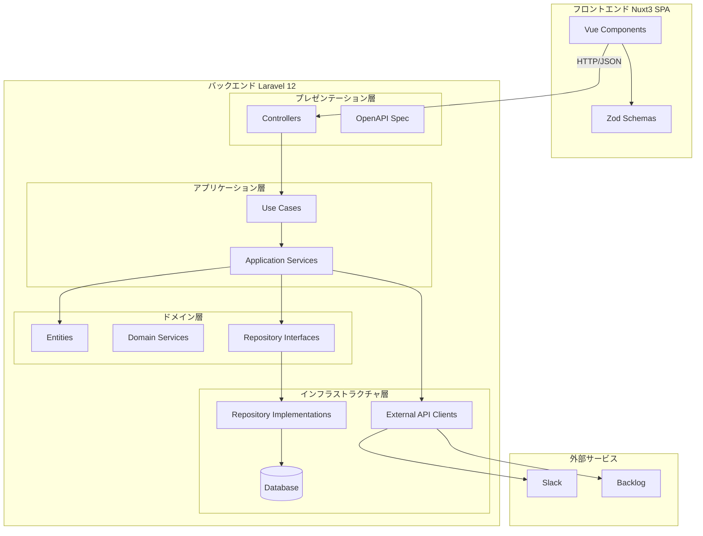
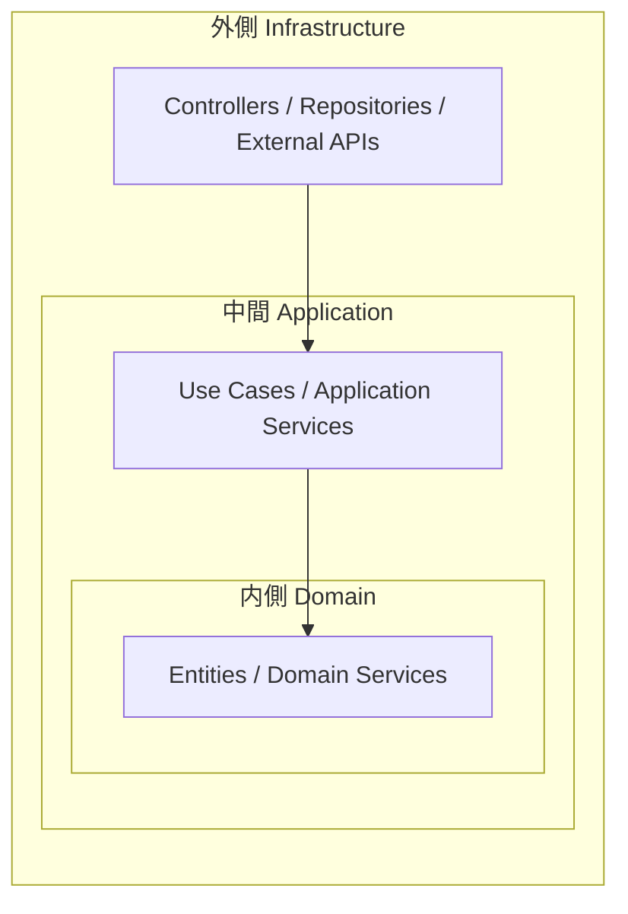
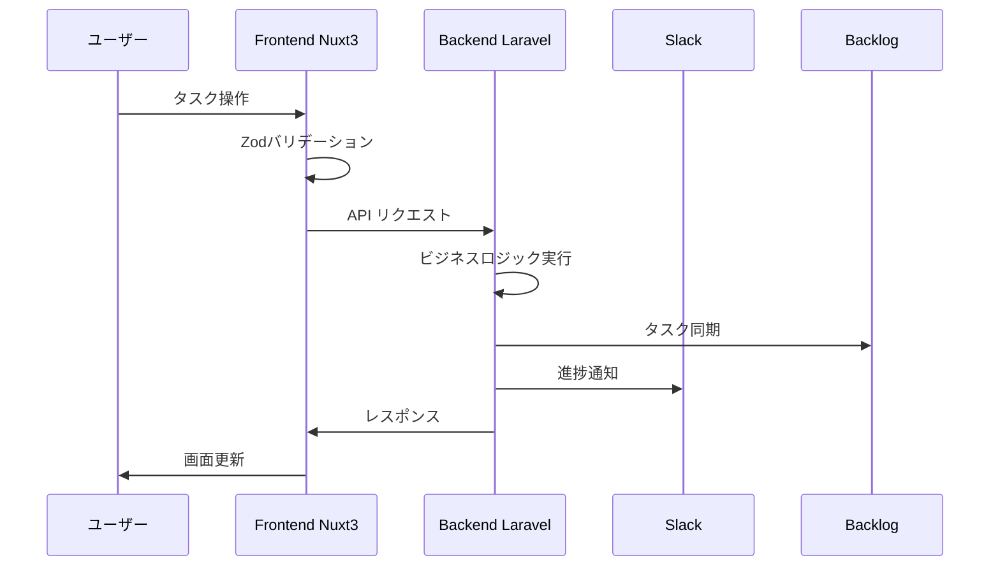

# アーキテクチャ図

## システム全体構成

## オニオンアーキテクチャ

## データフロー

## ディレクトリとレイヤーの対応

| レイヤー | ディレクトリ | 責務 |
|---------|-------------|------|
| Presentation | `app/Http/Controllers` | HTTPリクエスト処理、レスポンス生成 |
| Application | `app/Application` | ユースケース実装、トランザクション管理 |
| Domain | `app/Domains` | ビジネスロジック、エンティティ、ドメインサービス |
| Infrastructure | `app/Infrastructure` | DB実装、外部API連携、技術的詳細 |
