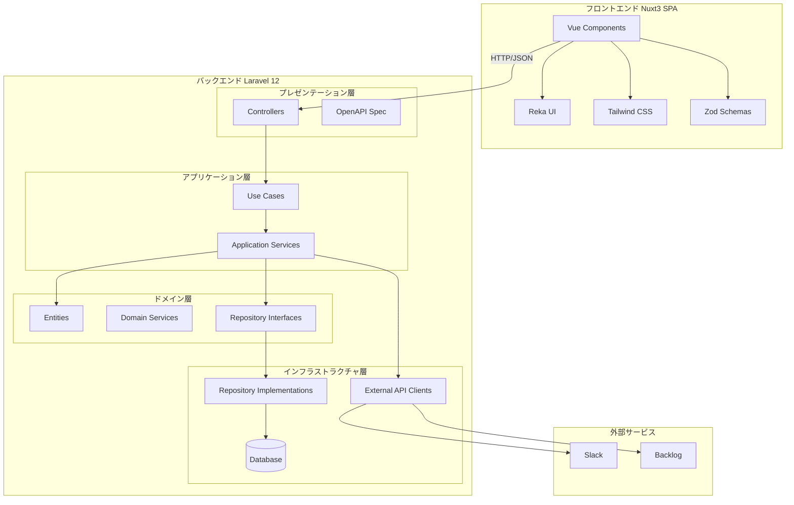
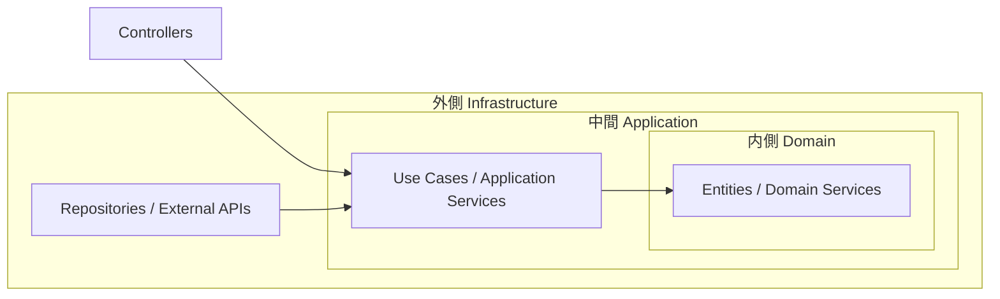
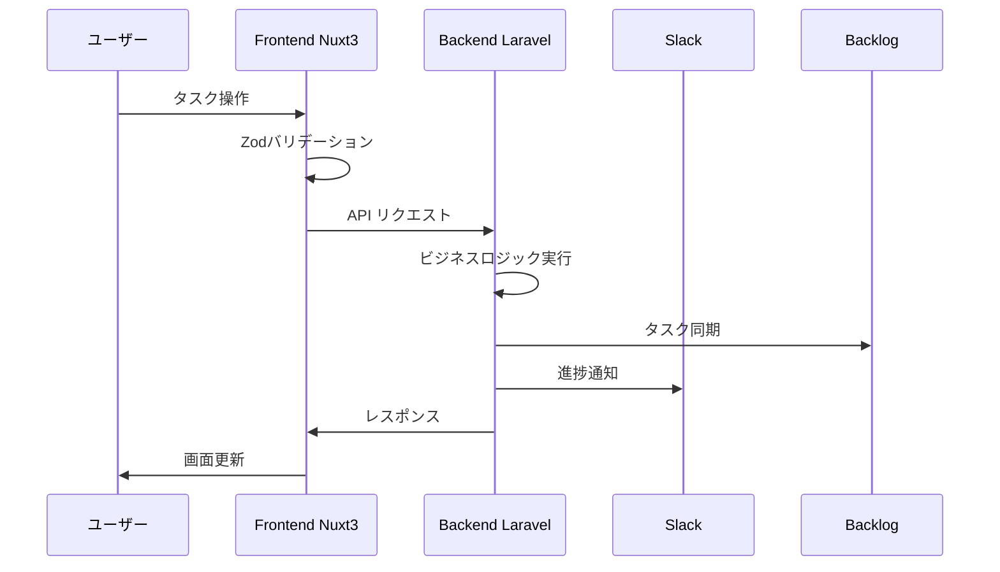

# アーキテクチャ図

## フロントエンド設計思想

### ヘッドレスコンポーネントアーキテクチャ

本プロジェクトのフロントエンドは**ヘッドレスコンポーネント**の設計思想を採用する。

#### 基本原則

- **ロジックと見た目の分離**: コンポーネントの振る舞い（状態管理・アクセシビリティ・キーボード操作）をUIの見た目から分離する
- **スタイルの自由度**: ヘッドレスコンポーネントはスタイルを持たず、Tailwind CSSのユーティリティクラスで外観を定義する
- **アクセシビリティの担保**: WAI-ARIA準拠のインタラクションをヘッドレスコンポーネントが提供し、開発者が個別に実装する必要をなくす

#### 技術選定

| ライブラリ | 役割 |
|---|---|
| **Reka UI** | ヘッドレスUIプリミティブ（Dialog, Menu, Select, Tabs等） |
| **Tailwind CSS** | ユーティリティファーストのスタイリング |

#### コンポーネント設計方針

```
UIコンポーネント = Reka UI（振る舞い） + Tailwind CSS（見た目）
```

- Reka UIが提供するプリミティブを使い、プロジェクト固有のデザインを Tailwind CSS で適用する
- 再利用可能なUIパーツは `app/components/ui/` に配置し、Reka UIをラップした形で提供する
- ページ固有のコンポーネントは `app/components/` 配下に機能単位で配置する

#### レイヤー構造

```
app/
├── components/
│   ├── ui/              # Reka UI ラッパー（プロジェクト共通UI部品）
│   │   ├── UiButton.vue
│   │   ├── UiDialog.vue
│   │   └── UiSelect.vue
│   └── <feature>/       # 機能単位のコンポーネント
├── composables/         # ロジックの再利用（状態管理・API通信）
├── pages/               # ページコンポーネント
└── layouts/             # レイアウト
```

## システム全体構成


```mermaid
graph TB
    subgraph External["外部サービス"]
        Slack[Slack]
        Backlog[Backlog]
    end

    subgraph Frontend["フロントエンド Nuxt3 SPA"]
        Vue[Vue Components]
        RekaUI[Reka UI]
        TailwindCSS[Tailwind CSS]
        Zod[Zod Schemas]
        Vue --> RekaUI
        Vue --> TailwindCSS
        Vue --> Zod
    end

    subgraph Backend["バックエンド Laravel 12"]
        subgraph Presentation["プレゼンテーション層"]
            Controllers[Controllers]
            OpenAPI[OpenAPI Spec]
        end

        subgraph Application["アプリケーション層"]
            UseCases[Use Cases]
            Services[Application Services]
        end

        subgraph Domain["ドメイン層"]
            Entities[Entities]
            DomainServices[Domain Services]
            Repositories[Repository Interfaces]
        end

        subgraph Infrastructure["インフラストラクチャ層"]
            RepoImpl[Repository Implementations]
            ExternalAPI[External API Clients]
            DB[(Database)]
        end
    end

    Vue -->|HTTP/JSON| Controllers
    Controllers --> UseCases
    UseCases --> Services
    Services --> Entities
    Services --> Repositories
    Repositories --> RepoImpl
    RepoImpl --> DB
    ExternalAPI --> Slack
    ExternalAPI --> Backlog
    Services --> ExternalAPI
```

## オニオンアーキテクチャ


```mermaid
graph LR
    subgraph Outer["外側 Infrastructure"]
        subgraph Middle["中間 Application"]
            subgraph Inner["内側 Domain"]
                Core[Entities / Domain Services]
            end
            App[Use Cases / Application Services]
        end
        Infra[Repositories / External APIs]
    end
    Pres[Controllers]

    Pres --> App
    Infra --> App --> Core
```

## データフロー


```mermaid
sequenceDiagram
    participant U as ユーザー
    participant F as Frontend Nuxt3
    participant B as Backend Laravel
    participant S as Slack
    participant BL as Backlog

    U->>F: タスク操作
    F->>F: Zodバリデーション
    F->>B: API リクエスト
    B->>B: ビジネスロジック実行
    B->>BL: タスク同期
    B->>S: 進捗通知
    B->>F: レスポンス
    F->>U: 画面更新
```

## ディレクトリとレイヤーの対応

| レイヤー | ディレクトリ | 責務 | 依存先 |
|---------|-------------|------|--------|
| Presentation | `app/Http/Controllers` | HTTPリクエスト処理、レスポンス生成 | 全レイヤー |
| Application | `app/Application` | ユースケース実装、トランザクション管理 | Domain のみ |
| Domain | `app/Domains` | ビジネスロジック、エンティティ、ドメインサービス | なし（コアレイヤー） |
| Infrastructure | `app/Infrastructure` | DB実装、外部API連携、技術的詳細 | Domain のみ |

**重要**: 依存関係は常に内側を向きます。Domain レイヤーは外部依存を持ちません。

## レイヤー詳細

### Presentation（`app/Http`）

#### 責務

- 認証/認可チェック
- リクエストデータ(Json)→PHPデータ型への変換
- PHPデータ型→レスポンスデータ(Json)への変換
- リクエストデータのバリデーション処理
- レスポンスデータのバリデーション処理
- Applicationの呼び出し
    - 原則 Controller 1 method につき Application 1 method とする
        - 更新後の再取得時にQueryServiceを呼び出すのはOK
    - 1コントローラー1メソッド（\_\_invoke）とする
    ```php
        class GetListController {}
        class CreateController {}
        class UpdateController {}
        class DeleteController {}
    ```
    ```
    Controllers/
        Project/
            GetListController.php    ← 一覧取得
            CreateController.php     ← 案件作成
            UpdateController.php     ← 案件更新
            DeleteController.php     ← 案件削除
    ```

#### 責務違反

- Domainの呼び出し
- Infrastructureの呼び出し
- 他集約のPresentation呼び出し
- DB直接アクセス
- ビジネスロジック記述

### Application（`app/Application`）

#### UseCase (Command)

**責務**

- Infrastructureの呼び出し
- Domainの呼び出し
    - Entity, ValueObject の生成
    - Entity の公開メソッド実行
        - Domain Factory が存在する場合, Entity の createファクトリメソッドは呼び出し禁止
    - Domain Factory の実行
    - Domain Service の実行

**責務違反**

- Presentationの呼び出し
- 他集約のUseCase/QueryServiceの呼び出し
- 集約をまたいだデータの取得
- DB直接アクセス
- ビジネスロジック記述

### Domain（`app/Domains`）

#### Entity

- 一意にデータを識別できる最小単位
- Identifier を必ずメンバーに持つ
- 他集約のEntityやValueObjectをメンバーに持つ
- 他集約のEntityやValueObjectに関するバリデーションをconstructor内で行う
- 完全イミュータブル

#### ValueObject

- 一意に識別する必要のないデータ
- Identifier は持たない
- Entity に属する場合もあるし、属さない場合もある
- 値に関するバリデーションをconstructor内で行う
- 完全イミュータブル

#### DomainService

- Entity に記載すると不自然な処理やビジネスロジックを記述する
    - e.x. Entity の存在チェック
- ドメイン貧血症になるため原則使用禁止
    - 可能な限りEntityにビジネスロジックを持たせること

#### Factory

- Entity や ValueObject の生成ロジックを記述
- 下記の場合にFactoryを検討する
    - Entity/ValueObject 生成条件やロジックが複雑な場合
    - 生成条件を Entity/ValueObject に記述したいが不自然な場合
        - e.x. EntityId の採番処理

### Infrastructure（`app/Infrastructure`）

#### 責務

- DBアクセス
    - MySQL, Redis など
- 外部API/サービスへのアクセス
    - AWS S3
    - Slack API
- Email送信
    - SMTP通信
- Domainの呼び出し
    - Entity の永続化/復元
    - Entity の取得/削除

#### 責務違反

- Presentationの呼び出し
- Applicationの呼び出し
- 他集約のInfrastructure呼び出し
