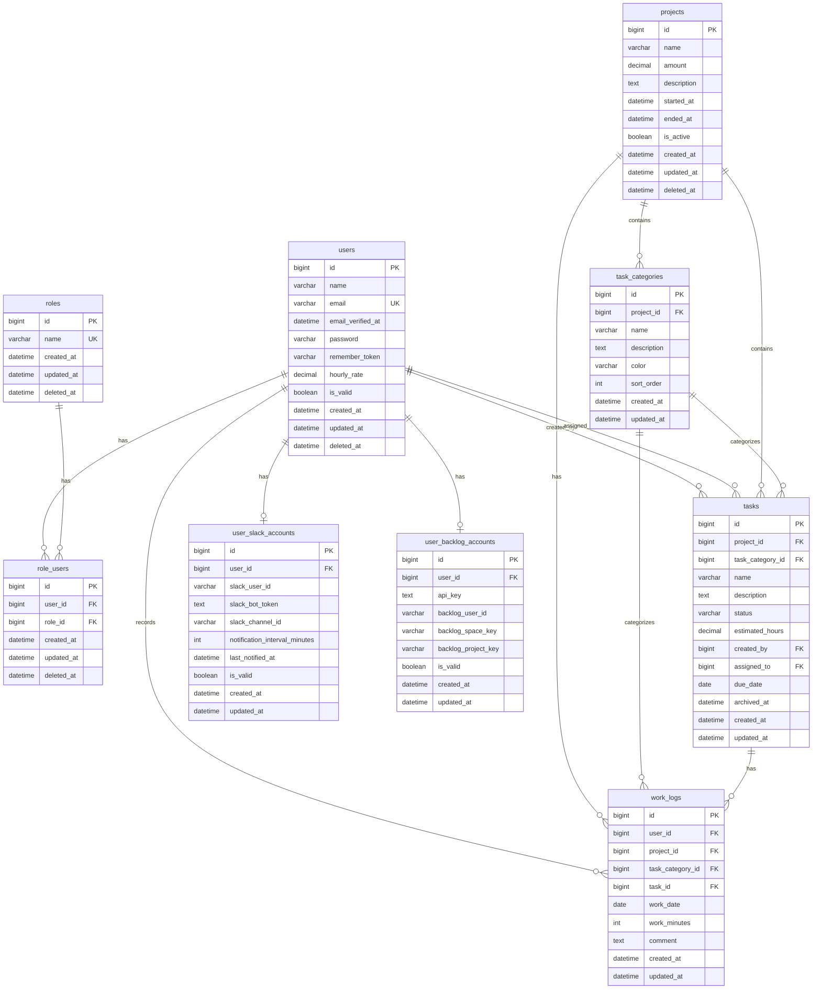

# ER図

## 概要

工数管理システムのエンティティ関連図

## ER図

## リレーション一覧

| 親テーブル      | 子テーブル            | カーディナリティ | 説明                     |
| --------------- | --------------------- | ---------------- | ------------------------ |
| users           | role_users            | 1:N              | ユーザーのロール割当     |
| roles           | role_users            | 1:N              | ロールのユーザー割当     |
| users           | tasks                 | 1:N              | タスク作成者/担当者      |
| users           | work_logs             | 1:N              | ユーザーの作業実績       |
| users           | user_slack_accounts   | 1:0..1           | Slack 連携情報           |
| users           | user_backlog_accounts | 1:0..1           | Backlog 連携情報         |
| projects        | task_categories       | 1:N              | 案件の作業分類           |
| projects        | tasks                 | 1:N              | 案件のタスク             |
| projects        | work_logs             | 1:N              | 案件の作業実績           |
| task_categories | tasks                 | 1:N              | カテゴリのタスク         |
| task_categories | work_logs             | 1:N              | カテゴリの作業実績       |
| tasks           | work_logs             | 1:N              | タスクの作業実績         |
